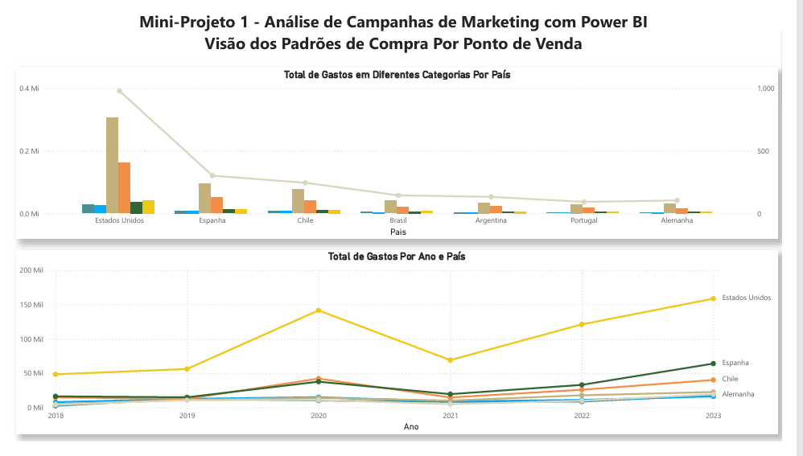

# 🎯 Performance de Campanhas de Marketing (ROI & Conversão)
💡 Pitch: Otimização de investimentos em marketing digital através da análise de ROI, funil de conversão e eficiência de custo por canal publicitário.

# 📌 Visão Geral
Este dashboard foi desenvolvido para monitorar e otimizar a alocação de verbas publicitárias na organização fictícia . O foco central é transformar dados de tráfego e anúncios em inteligência comercial, permitindo identificar quais canais (Google, Facebook, Instagram, etc.) entregam o melhor retorno sobre o capital investido.

Objetivo: Analisar a conversão e o ROI para maximizar a eficiência do orçamento de marketing.

Público-alvo: CMOs (Diretores de Marketing), Gestores de Tráfego e Analistas de Performance.

Fonte de Dados: Base estruturada do curso "Data Science Academy " , simulando uma operação real de marketing digital.
# IMAGEM DO DESHBOARD 
  

 

🛠️ Tecnologias e Ferramentas
Power BI: Desenvolvimento de dashboards interativos e storytelling de dados.

Linguagem DAX: Cálculos de ROI dinâmico, taxas de conversão e métricas de eficiência (CPA/CPC).

Power Query (ETL): Integração e padronização de bases de dados provenientes de diferentes plataformas de anúncios.

📊 Indicadores Chave (KPIs)
O painel foca nas métricas que realmente movem o ponteiro do negócio:

ROI (Retorno sobre Investimento): Quanto a empresa fatura para cada R$ 1,00 investido.

Taxa de Conversão: Eficiência do funil de vendas (Clique vs. Venda).

Custo por Aquisição (CPA): Quanto custa, em média, conquistar um novo cliente por canal.

Faturamento vs. Investimento: Visão clara da margem bruta gerada pelas campanhas.

💡 Insights e Análise de Negócio
📈 Conclusões Estratégicas extraídas:
Otimização de Canais (Custo-Benefício): A análise permite identificar canais que possuem um faturamento alto, mas um ROI baixo devido ao custo elevado do anúncio. Isso sinaliza a necessidade de pausar ou otimizar campanhas onde o Custo por Clique (CPC) está corroendo a margem.

Saúde do Funil de Vendas: Através do Gráfico de Funil, é possível detectar onde ocorre a maior perda de potenciais clientes. Se a taxa de conversão cai bruscamente entre o clique e o fechamento, o problema pode estar na página de vendas ou no processo de checkout, e não na qualidade do anúncio.

Alocação Inteligente de Orçamento: O dashboard revela quais categorias de produtos ou campanhas performam melhor em determinadas regiões. Com esses dados, o gestor pode direcionar a verba para onde o ROI é historicamente superior, aumentando o faturamento sem necessariamente aumentar o investimento total.

Sazonalidade e Comportamento: Ao analisar a performance temporal, conseguimos identificar períodos onde o investimento em marketing não se traduz em vendas, permitindo um planejamento de "verba de reserva" para períodos de alta conversão comprovada.

⚙️ Inteligência de Dados
Lógica de ROI Dinâmico: Medidas DAX que recalculam automaticamente o retorno conforme os filtros de data e canal são aplicados, permitindo uma análise granular por mídia.

Modelagem Star Schema: Conexão entre a tabela fato de Investimento e a tabela fato de Vendas, garantindo que as métricas de custo e receita estejam perfeitamente alinhadas por data e categoria.

#✍️ Autor
Marcos Inada

Analista de Dados | Power BI | Insights de Mercado

LinkedIn: [https://www.linkedin.com/in/marcosinada/]

E-mail: marcoscorleone1985@gmail.com
