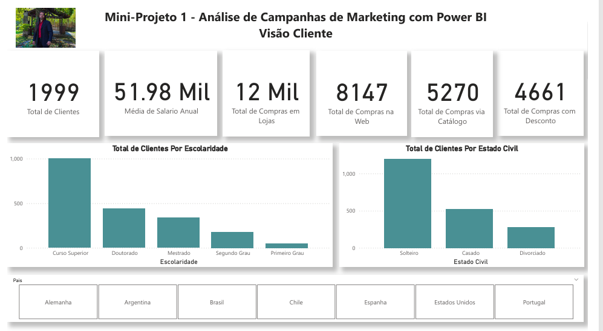
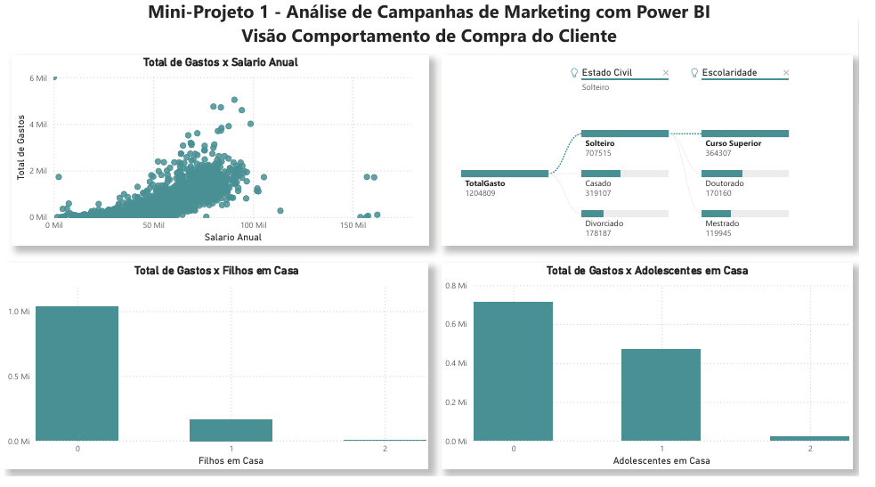
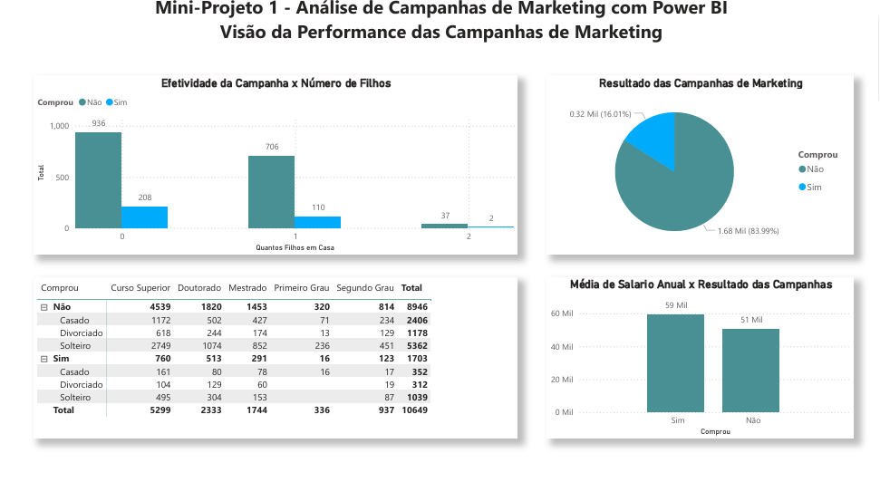

# Analise Campanhas de Marketing
Dashboard de Performance de Marketing desenvolvido no Power BI para análise de ROI, taxas de conversão e eficiência de investimentos por canal publicitário.
# 🎯 Dashboard de Performance de Campanhas de Marketing – ABC Corp
Este dashboard foi desenvolvido para monitorar e otimizar os investimentos em marketing digital, focando na análise de conversão e no retorno sobre o investimento (ROI) por canal.

# 📝 Contexto do Projeto
O objetivo central é fornecer uma visão clara de como o orçamento de marketing está sendo transformado em vendas. O painel permite identificar quais canais (Google, Facebook, Instagram, etc.) trazem clientes com menor custo e maior potencial de compra, facilitando a tomada de decisão sobre onde investir mais verba.
# IMAGEM DO PROJETO 
  

 
 

# 📈 Indicadores Chave de Performance (KPIs)
O dashboard destaca métricas fundamentais para o marketing orientado a dados:

Investimento Total: Valor acumulado aplicado em campanhas e anúncios.

Faturamento Gerado: Valor bruto das vendas originadas pelas campanhas.

Taxa de Conversão: Percentual de cliques que se transformaram em vendas efetivas.

ROI (Retorno sobre Investimento): Indicador de quanto a empresa ganhou para cada real investido.

Custo por Clique (CPC) / Custo por Aquisição (CPA): Métricas de eficiência de custo por canal.

# 🎨 Apresentação Gráfica e Visualização
Para uma análise estratégica, o relatório conta com:

Gráfico de Funil: Visualização do fluxo do cliente, desde o primeiro contato até o fechamento da venda.

Gráfico de Barras Comparativo: Performance de vendas e investimento lado a lado por canal de anúncio.

Gráficos de Rosca/Pizza: Distribuição percentual do faturamento por categoria de campanha.

Segmentadores Dinâmicos: Filtros por período, região e tipo de mídia para análises rápidas.

# 🛠️ Inteligência de Dados com DAX
Aplicação de lógica avançada para métricas de marketing:

Cálculo de ROI Dinâmico: Medidas que recalculam o retorno automaticamente conforme os filtros de data e canal são aplicados.

Métricas de Conversão: Fórmulas para medir o sucesso de cada campanha individualmente.

Análise de Eficiência: Comparativos entre o custo planejado e o faturamento realizado.

# ⚙️ Processo de ETL e Modelagem
Power Query: Limpeza e padronização das bases de dados de diferentes plataformas de anúncios.

Modelagem Star Schema: Conexão entre a tabela fato de Investimento e a tabela fato de Vendas, utilizando dimensões comuns como Calendário e Produto. 
  

 

 

# 💾 Origem e Fonte dos Dados
Projeto desenvolvido com base no curso "Business Intelligence Completo do ETL ao Power BI" do professor André Rosa (Udemy). A base de dados é fictícia, simulando uma operação real de marketing digital.
